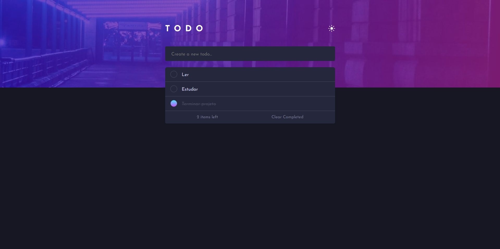
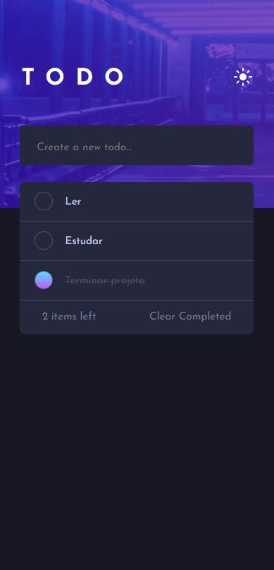

# Todo app

## Sobre o projeto

https://todo-app-six-eosin-34.vercel.app/

Lista de tarefas onde os usuários podem:
- Criar novas tarefas.
- Marcá-las como concluídas.
- Deletar as tarefas manualmente.
- Deletar todas as tarefas concluídas.

#

## Layout web

#

## Layout mobile

#

## Tecnologias utilizadas

- HTML
- CSS
- JavaScript

#

## Aprendizado com o projeto

- Armazenar dados no LocalStorage, evitando a perda de dados ao atualizar a página.
- Habilidades aprimoradas na manipulação do DOM.

#

## Autor

Davi Mendonça Moreira

https://www.linkedin.com/in/davi-moreira-a71587261/
